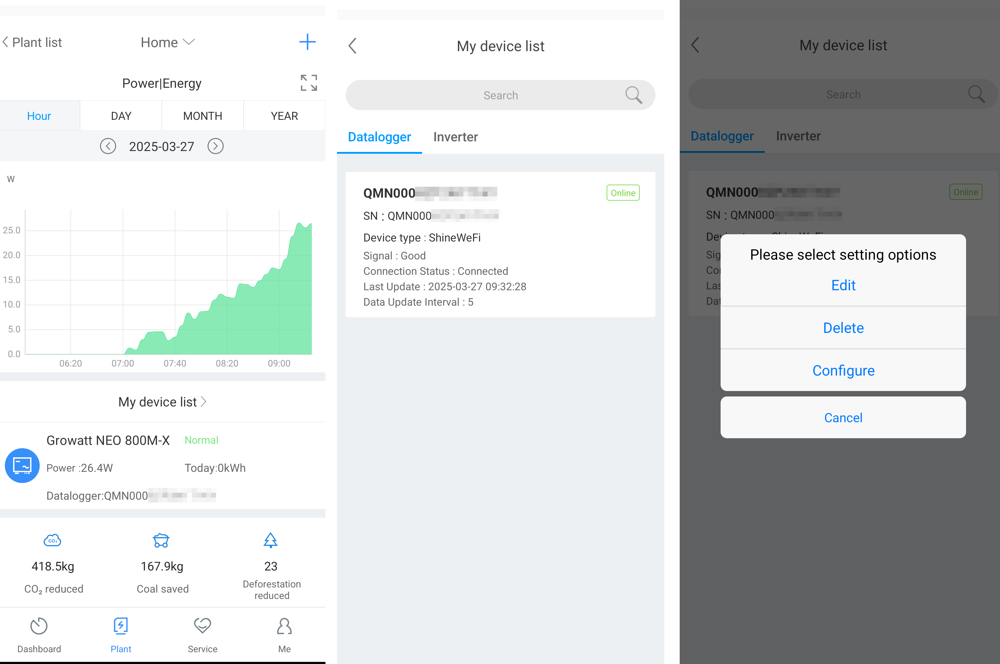
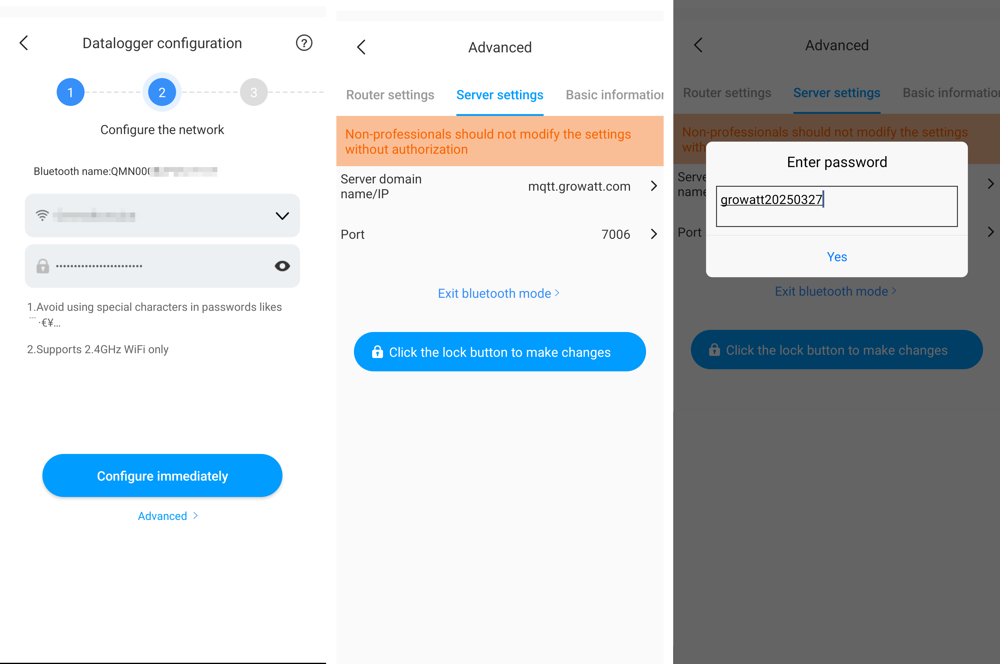
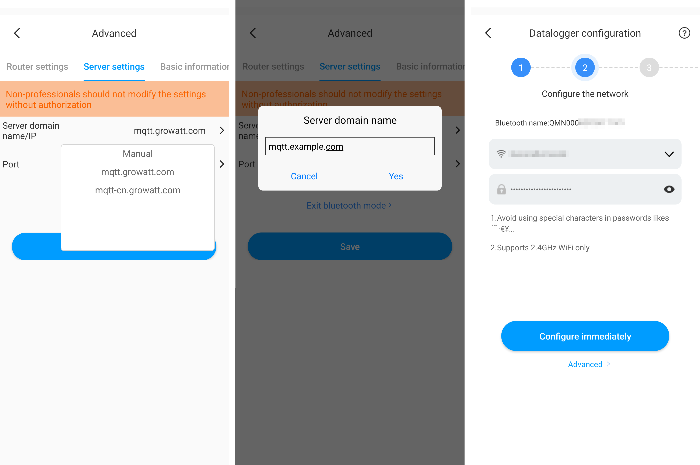
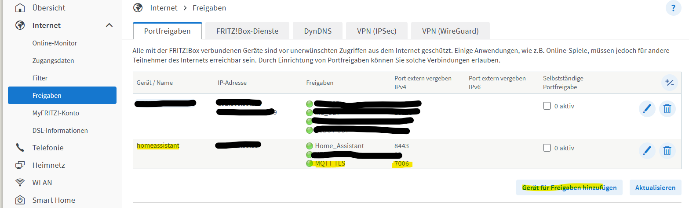
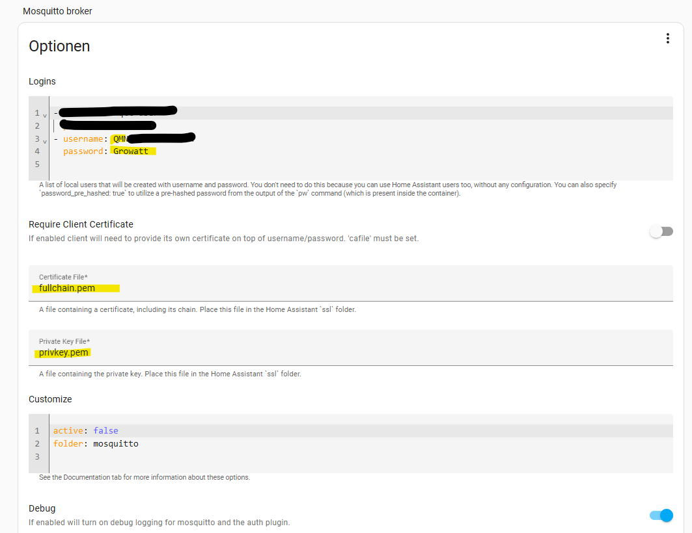
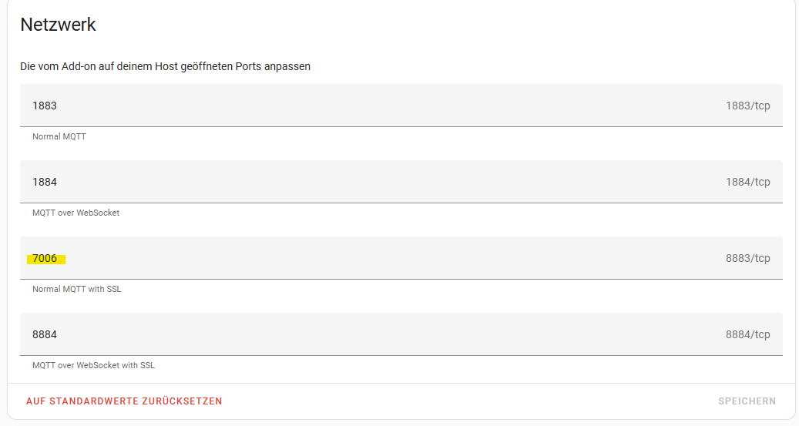

# Configuration

### 1. Prerequisites

You have a valid Let’s Encrypt certificate.

You have the following files:
- `fullchain.pem` – contains server + intermediate certificates
- `privkey.pem` – your private key

These are usually located in `/etc/letsencrypt/live/<your-domain>/`

Our setup needs the full trust chain including the root. Head over to the [Certificates Guide](CERTIFICATES.md) for details:
```bash
curl -o root.pem https://letsencrypt.org/certs/isrgrootx2.pem
cat fullchain.pem root.pem > chain-full.pem
```

So now you have:
- `chain-full.pem` (cert chain including ISRG Root X2 certificate)
- `privkey.pem` (private key)

### 2. Mosquitto TLS Configuration

Create a Mosquitto config file:
```
# Listener on port 7006 for TLS
listener 7006

# Path to certs and key
certfile /mosquitto/certs/chain-full.pem
keyfile /mosquitto/certs/privkey.pem
cafile /mosquitto/certs/root.pem

# Allow anonymous connections
allow_anonymous true
```

### 3. Run the Mosquitto TLS Container

Make sure your volume mounts place the certs and config properly:
```
/mosquitto
├── config
│   └── mosquitto.conf
├── certs
│   ├── chain-full.pem
│   ├── privkey.pem
│   └── root.pem
```

Now run the Mosquitto container like this and check the logs for any errors:
```bash
docker run --detach \
  --name mosquitto-tls \
  --publish 7006:7006 \
  --volume ./mosquitto-tls/conf:/mosquitto/config \
  --volume ./mosquitto-tls/data:/mosquitto/data \
  --volume ./mosquitto-tls/certs:/mosquitto/certs \
  docker.io/library/eclipse-mosquitto:latest
```

### 4. Setup the Growatt Device

Open the ShinePhone app and tap on `Devices List`. Select the inverter you want to configure for your own MQTT server and tap `Configure`.
Make sure you are within Bluetooth range and the inverter is powered on. Configuration cannot be performed at night when the inverter is off.



Next, tap `Advanced` and open the `Server settings` tab. Tap the lock icon and enter the password, which is based on the current date:

`growatt<YYYYMMDD>`

Then tap `Yes`.



Once unlocked, the settings can be modified. For `Server domain name/IP`, choose `Manual` and enter the address of your Mosquitto instance configured for TLS. Do the same for the `Port` field.
Return to the main configuration screen and tap `Configure immediately`. You can ignore the final step when the app attempts to connect to the Growatt cloud. After that, you may close the app.



Additionally: Block the device from accessing the internet after configuration to prevent it from reverting settings or syncing with the cloud.

### 5. Run the GroBro HA Bridge

This example demonstrates how to run the GroBro HA bridge with a dedicated TLS-secured Mosquitto instance for the Growatt device as the source, and a separate MQTT broker for Home Assistant as the target:
```bash
docker run --detach \
  --name grobro-bridge \
  --env SOURCE_MQTT_HOST=<source-mqtt-host> \
  --env SOURCE_MQTT_PORT=<source-mqtt-port> \
  --env SOURCE_MQTT_TLS=true \
  --env TARGET_MQTT_HOST=<target-mqtt-host> \
  --env TARGET_MQTT_PORT=<target-mqtt-port> \
  ghcr.io/robertzaage/grobro:latest
```

### Environment Variable Reference

| Variable             | Required | Description                                                                 |
|----------------------|----------|-----------------------------------------------------------------------------|
| `SOURCE_MQTT_HOST`   | ✅ Yes   | Hostname or IP of the source MQTT broker (for Growatt)                     |
| `SOURCE_MQTT_PORT`   | ✅ Yes   | Port number of the source MQTT broker                                      |
| `SOURCE_MQTT_TLS`    | ❌ No    | Set to `true` to enable TLS without certificate validation                 |
| `SOURCE_MQTT_USER`   | ❌ No    | Username for the source MQTT broker (if authentication is required)        |
| `SOURCE_MQTT_PASS`   | ❌ No    | Password for the source MQTT broker                                        |
| `TARGET_MQTT_HOST`   | ✅ Yes   | Hostname or IP of the target MQTT broker (for Home Assistant)              |
| `TARGET_MQTT_PORT`   | ✅ Yes   | Port number of the target MQTT broker                                      |
| `TARGET_MQTT_TLS`    | ❌ No    | Set to `true` to enable TLS without certificate validation                 |
| `TARGET_MQTT_USER`   | ❌ No    | Username for the target MQTT broker (if authentication is required)        |
| `TARGET_MQTT_PASS`   | ❌ No    | Password for the target MQTT broker                                        |
| `HA_BASE_TOPIC`      | ❌ No    | Base MQTT topic used for Home Assistant auto-discovery and sensor states   |
| `REGISTER_FILTER`    | ❌ No    | Comma-separated list of `serial:alias` pairs (e.g. `123456789:NOAH,987654321:NEO800`). Allows specifying which register set to apply per device. Defaults to inverter register map if not set. |
| `ACTIVATE_COMMUNICATION_GROWATT_SERVER` | ❌ No    | Set to `true` to redirect messages to and from the Growatt Server. This is turned off by default. |
| `LOG_LEVEL` | ❌ No    | Sets the logging level to either `ERROR`, `DEBUG`, or `INFO`. If not set `ERROR` is used. |
| `DUMP_MESSAGES`      | ❌ No    | Dumps every received messages into `/dump` for later in-depth inspection. |

# Example Setup with DuckDNS and HA-MQTT

### 1. Set up DynDNS Address and Certificates
There are many guides available on how to do this. I use a DuckDNS address and the DuckDNS add-on to create the certificates. Just follow their guide. Your certificate should then be located at `/ssl/fullchain.pem` and your key at `/ssl/privkey.pem`.

### 2. Open Port in Your Router and Redirect to Home Assistant
If you completed step 1, you should already know how to do this. Open port **7006** and redirect it to your Home Assistant instance. Example on a FritzBox:


(It might also be possible to use the default MQTT TLS port **8883**. In that case, you must also change the port in the ShinePhone app as described in step 4 of the configuration guide above. Alternatively, you can open external port **7006** and redirect it internally to **8883** — there are many ways to set it up 😉.)

### 3. Set up HA-MQTT
You just need to create a new user.  
The username must be the serial number of your inverter. (If you are unsure, enable debug logging and check the logs while reconfiguring your inverter or Noah. You should see a line like `"checking auth cache for <username>"` in the logs.)

The password is **Growatt**.

Make sure the certificate names from step 1 are correctly configured:


Start your MQTT server on port **7006** (or on the default TLS port, as described above):


### 4. Check If Everything Works
You can use MQTT Explorer (https://github.com/thomasnordquist/MQTT-Explorer) for this.  
Make sure that **Validate certificate** and **Encryption** are enabled.  
If you can log in, everything is working correctly!


### 5. Optional: DNS Rewrite
To stay fully local, you can set up a DNS server (like AdGuard) to rewrite your `*.duckdns.org` address to the IP of your Home Assistant instance. The certificates will remain valid.
